# REVENANTS
### A Technical Design Document, Told as a Story

> **Version 1.1** · iOS 18+ · Swift 6 · VIPER + SwiftUI
> Two iPhones. One curse. Split senses. Shared room.

---

## Prologue: The Doll on the Rug

Two players stand in the same living room. Same couch, same coffee table, same walls they've stared at a thousand times. They raise their phones. On screen, sitting on the real rug, is a doll that wasn't there a second ago.

They reach out together and tap it.

The curse activates — and their senses are torn apart. One goes deaf and gains sight beyond sight: hidden footprints, glowing locks, messages burned into real walls. The other goes blind and gains impossible hearing: whispers from empty corners, a heartbeat that quickens as danger nears.

They are standing shoulder to shoulder in the same physical room, living in two different nightmares, and the only way out is to trust each other's voice.

This document is the engineering behind that nightmare — how two iPhones agree on one haunted room, why one of them can see the dead and the other can only hear them, and what happens when the network hiccups in the middle of a jump-scare.

---

## Table of Contents

1. [The Two Realities](#1-the-two-realities)
2. [How the House Is Built](#2-how-the-house-is-built)
3. [The Handshake — Two Phones Agreeing on One Ghost](#3-the-handshake--two-phones-agreeing-on-one-ghost)
4. [The Machinery Behind the Curse](#4-the-machinery-behind-the-curse)
5. [The Bones of the Curse — Data Model](#5-the-bones-of-the-curse--data-model)
6. [The Vault — Project Structure](#6-the-vault--project-structure)
7. [Keeping the Curse Contained — Security & App Store](#7-keeping-the-curse-contained--security--app-store)
8. [What Could Go Wrong in the Dark](#8-what-could-go-wrong-in-the-dark)
9. [The Toolbox](#9-the-toolbox)

---

## 1. The Two Realities

Before any curse can split a player's senses, something has to build the room they're standing in — accurately, in real-world coordinates, down to the centimeter. That job needs LiDAR. Not every iPhone has it. So the game turns that hardware gap into the plot itself.

One phone becomes the **Host** — it has LiDAR, and it draws the map. The other becomes the **Guest** — it has an ordinary camera, and it moves into the map the Host built.

| | Host | Guest |
| :--- | :--- | :--- |
| **Device** | LiDAR-equipped iPhone | Any standard ARKit iPhone |
| **Tracking** | LiDAR + visual-inertial odometry | Visual-inertial odometry only |
| **Responsibilities** | Room scan, world authority, spawn decisions | World merge, sensory gameplay |
| **Exclusive capabilities** | RoomPlan scan, scene mesh reconstruction | — |

The Host builds a metrically accurate model of the actual living room. The Guest doesn't scan anything — it joins the Host's coordinate space through ARKit's collaborative session, quietly trading map data over a local connection until both phones agree, to the centimeter, where the doll is sitting.

### The Night, Beat by Beat

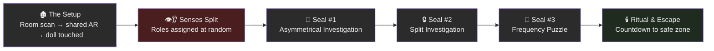

**The Setup.** Both players connect over Wi-Fi. The Host scans the room while the Guest waits. A doll materializes at the center of the floor. Both players touch it. The curse takes hold, and roles are assigned at random.

**Seal #1 — Asymmetrical Investigation.** The first hidden object appears: a letter, anchored to a wall. The Listener is pulled toward it by sound and touch; the Seer arrives and reveals it visually. When the Seer gets within a meter, the mission is spoken aloud for the first time:

> *"To break the curse, you must find the two pieces of the ancient seal. Only when the seal is restored will the monster lose its power."*

| Role | What the Letter feels like |
| :--- | :--- |
| **Seer** | A pale plane glowing on the wall; total silence |
| **Listener** | Nothing visible — just spatial audio and haptic pulses closing in |

**Seal #2 — Split Investigation.** The Seer alone sees bloody footprints leading to a locked mechanism. The Listener, still blind, hears whispers that sharpen into a code as they walk closer. Neither piece of information is useful alone — the code lives in one player's ears, the lock in the other's eyes.

**Seal #3 — Frequency Puzzle.** The Seer finds a number in the environment — a frequency. The Listener opens a tuning dial that fades from white noise into a clear signal as they approach the right value:

$$C = \max\left(0,\ 1 - \frac{|F_p - F_t|}{\text{HearingRange}}\right)$$

Lock the frequency, and the Seer hears the mechanism click open on their end.

**Ritual & Escape.** Haptics intensify as both players are pulled back to the ritual site. The Seer sets both seal pieces on the pedestal. Senses restore all at once — and a countdown begins as a safe zone glows on the real floor.

### The Split at a Glance

| Sense | Seer | Listener |
| :--- | :--- | :--- |
| **Vision** | Full AR passthrough + hidden entities | Heavy blur, dark vignette, no clue visuals |
| **Audio** | Static / white noise overlay | Spatial 3D audio anchored to world positions |
| **Haptics** | None | Distance-modulated pulse toward objectives |
| **Guidance role** | Leads physically, reveals clues on arrival | Leads navigation by sound and vibration |

---

## 2. How the House Is Built

Under the horror, this is a disciplined VIPER app. Every screen — Lobby, Scanning, Seance, Gameplay — is its own self-contained module, and two long-lived services sit quietly underneath all of them, holding the state that's too heavy or too persistent to belong to any one screen.

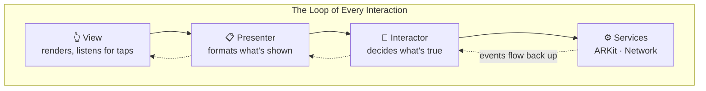

| Layer | Job | Never does |
| :--- | :--- | :--- |
| **View** | Render UI, overlays, gestures | Talk to ARKit or TCP directly |
| **Presenter** | Expose `@Published` view state | Contain business rules |
| **Interactor** | Distance checks, role logic, timers, service wiring | Render SwiftUI |
| **Entity** | Pure data (`NetworkEvent`, `PlayerRole`) | Side effects |
| **Router** | Trigger screen transitions | Hold game state |

Two services sit beneath every screen, outliving any single module:

| Service | Owns | Lives from |
| :--- | :--- | :--- |
| `NetworkService` | Bonjour discovery, TCP connection, event bus | App launch |
| `ARService` | Collaborative `ARView`, entity spawning, letter spatial audio (`playAudio`) | Seance screen onward |

An `AppCoordinator` walks the player through the night: `lobby → scanning → seance → curseBegins → gameplay`.

### The Rules the House Never Breaks

| Principle | What it means |
| :--- | :--- |
| **Host authority** | Random seeds, spawn coordinates, and puzzle answers are computed once on the Host and replicated to the Guest |
| **Sensory separation** | Audio and visuals are gated per-entity by `PlayerRole` in `ARService` — Seer gets visuals only, Listener gets a spatial audio emitter only |
| **Single TCP pipe** | JSON gameplay events and binary AR blobs share one connection, distinguished by a 1-byte frame header |
| **No MultipeerConnectivity** | All transport uses `Network.framework` with Bonjour service `_arcurse._tcp` |

### Who Owns What

| Concern | Owner | Never in |
| :--- | :--- | :--- |
| Proximity / distance checks | `GameplayInteractor` | View, Presenter, `ARService` |
| 60 fps proximity loops | `GameplayInteractor` | View |
| Network event parse & dispatch | `GameplayInteractor` | View |
| Entity spawn, role-gated visibility & letter audio | `ARService` | Interactor, View |
| Overlay text, buttons, sliders | `GameplayView` | Interactor |
| `@Published` view state | `GameplayPresenter` | Interactor |

### The Full Architecture

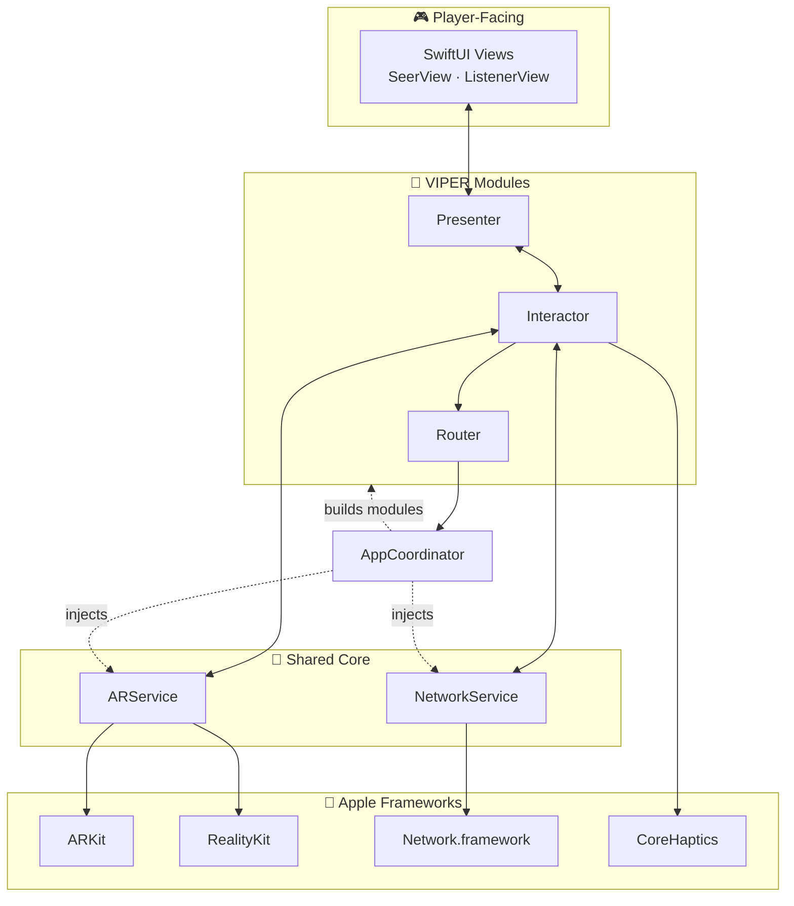

---

## 3. The Handshake — Two Phones Agreeing on One Ghost

Before the first jump-scare, two phones that have never met have to agree on a shared reality: find each other, connect, scan the room, and merge their separate understandings of space into one — all before a single ghost is allowed to appear. Skip a step, and the doll spawns in a different spot on each screen.

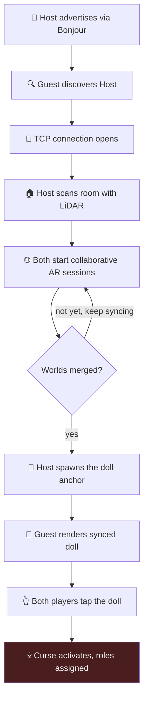

### The Full Sequence

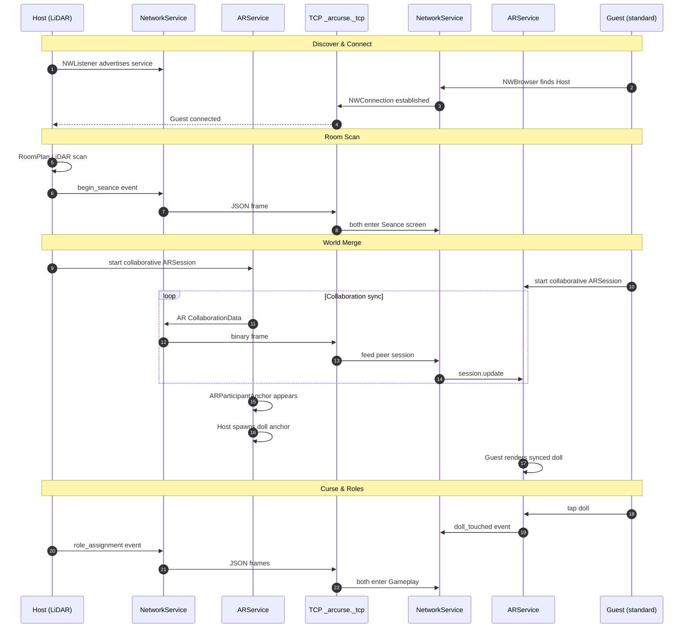

### The Wire Protocol

Every message on the wire carries a small header so the receiver knows, before parsing anything, whether it's holding a gameplay event or a chunk of ARKit's collaboration data.

| Byte(s) | Field | Values |
| :--- | :--- | :--- |
| 1 | **Kind** | `0` = JSON gameplay event · `1` = AR collaboration blob |
| 4 | **Length** | Big-endian `UInt32` payload size |
| N | **Payload** | `NetworkEvent` JSON or `NSKeyedArchiver` ARKit data |

| Kind | Contents | Backpressure rule |
| :--- | :--- | :--- |
| `0` | `role_assignment`, `letter_spawn`, `doll_touched`, etc. | Always delivered |
| `1` | `ARSession.CollaborationData` | Non-critical frames dropped when send queue exceeds 6 |

### The Screens, in Order

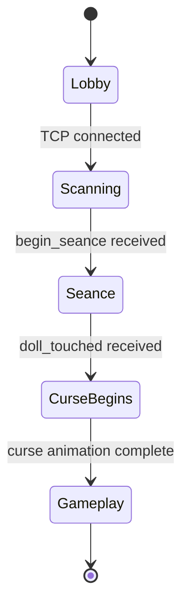

| Screen | Trigger | Both devices? |
| :--- | :--- | :--- |
| `Lobby` | App launch | Yes |
| `Scanning` | TCP connected | Host scans; Guest waits |
| `Seance` | `begin_seance` received | Yes — collaborative AR |
| `CurseBegins` | `doll_touched` received | Yes — transition overlay |
| `Gameplay` | Curse animation complete | Yes — role-specific UI |

---

## 4. The Machinery Behind the Curse

### 4.1 Merging Two Worlds Into One

Two different tracking systems have to agree the same doll is sitting in the same spot on the same rug. Here's how that agreement happens, step by step:

| Step | Actor | Action |
| :--- | :--- | :--- |
| 1 | Host | RoomPlan captures walls, floors, objects → `ScannedRoom` |
| 2 | Both | Start `ARWorldTrackingConfiguration` with `isCollaborationEnabled` |
| 3 | Both | Exchange `CollaborationData` over TCP (kind = 1) |
| 4 | Both | `ARParticipantAnchor` detected → `hasMergedWorlds = true` |
| 5 | Host | Adds shared `ARAnchor` for doll / letter |
| 6 | Guest | Receives anchor via collaboration; renders local RealityKit content |
| 7 | Host | Sends `letter_spawn` transform as network fallback |

The Host also builds a LiDAR scene mesh with collision and occlusion, so spatial audio can respect the actual walls of the room — a whisper shouldn't leak cleanly through drywall.

### 4.2 The Curse Rolls Its Own Dice

Nothing about the haunting is left to chance on two separate devices — every random decision is made once, on the Host, and handed to the Guest as fact. Two players can never see two different curses.

**Drawing a frequency without repeats:**

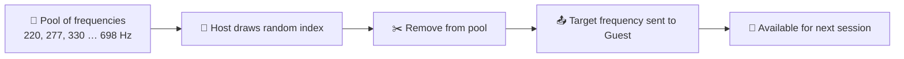

| Concept | Behavior |
| :--- | :--- |
| Pool | Predefined Hz values (e.g. 220, 277, 330 … 698) |
| Draw | Random index into remaining values; remove on use |
| Sync | Target frequency travels inside `GameStateSeed` (planned) |

The Listener's forgiveness curve while tuning the scanner:

$$C = \max\left(0,\ 1 - \frac{|F_p - F_t|}{\text{HearingRange}}\right)$$

**Deciding where the ghosts stand:**

| Technique | Used for | Rule |
| :--- | :--- | :--- |
| **Gaussian wall weighting** | Letter placement | Walls ~1.5 m from camera score highest; larger walls get area bonus |
| **Gaussian clamping** | Lateral wall offset | Sample clamped to ±35% of wall width |
| **Rejection sampling** | Doll floor placement | Up to 40 attempts; reject points within 0.4 m of obstacles |
| **Y-axis clamping** | All wall clues | Fixed at 1.4 m above lowest tracked floor |

### 4.3 The Sensory Engine

The split isn't a filter slapped over the camera feed — it's baked into every entity in the world. A ghost that's invisible to the Listener isn't hidden by a UI trick; it was never rendered for them in the first place.

**Spatial audio (Phase 6B — letter clue):**

Letter audio is owned entirely by `ARService` via RealityKit — not manual gain math in the Interactor. `GameplayInteractor` only runs the 60 fps haptic loop for the Listener; it does not drive letter playback.

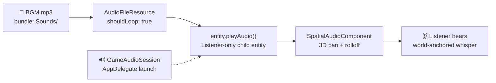

| Layer | Owner | Role |
| :--- | :--- | :--- |
| Session activation | `GameAudioSession` | `.playback` category on app launch — speaker ready before AR |
| Asset load | `ARService` | `Bundle.main.url(forResource: "BGM", subdirectory: "Sounds")` |
| Playback | `ARService` | `AudioFileResource` + `entity.playAudio()` on invisible listener entity |
| 3D rendering | RealityKit | `SpatialAudioComponent` handles panning and distance attenuation automatically |
| Proximity haptics | `GameplayInteractor` | `CADisplayLink` → distance → `LetterProximityHaptics` (audio-independent) |
| Doppler / custom DSP | `LetterAudioEngine` | **Not wired in** — reserved for future pitch-shift layer on top of RealityKit |

| Parameter | Seer | Listener |
| :--- | :--- | :--- |
| Letter visibility | White `ModelEntity` plane | No visual — invisible audio emitter only |
| Audio entity | **None** (no `playAudio`, no `SpatialAudioComponent`) | Child `Entity` with `SpatialAudioComponent` |
| `SpatialAudioComponent` gain | — | `Audio.Decibel(-3)` (near nominal; `Audio.Decibel` is a `Double` alias) |
| Distance attenuation | — | `.rolloff(factor: 1.0)` — RealityKit inverse-distance curve |
| Tap interaction | Enabled | Disabled |

**Sync note:** On Guest startup, `GameplayInteractor` replays a missed `letter_spawn` via `latestEvent(ofType:)` (same pattern as `role_assignment`) so the letter anchor and audio entity appear even if the Host placed the clue during the curse transition screen.

The Listener hunts by ear. The Seer hunts by sight. Neither can finish the hunt alone.

**Haptic proximity** — a continuous pulse toward the hidden letter, refreshed 60 times a second:

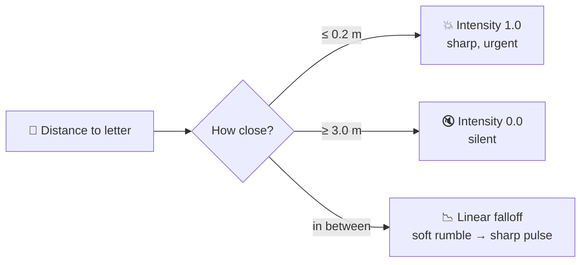

| Distance | Intensity |
| :--- | :--- |
| ≤ 0.2 m | 1.0 (maximum) |
| ≥ 3.0 m | 0.0 (silent) |
| Between | Linear falloff |

Sharpness co-scales with intensity, so distant rumble feels soft and proximity feels sharp under the fingers.

**Visual impairment for the Listener:**

| Effect | Implementation |
| :--- | :--- |
| Blur | `.blur(radius: 20)` over AR passthrough |
| Vignette | `RadialGradient` — opaque edges, faint center |
| Static | `StaticNoiseOverlay` (planned) |

---

## 5. The Bones of the Curse — Data Model

Strip away the ghosts and the whispers, and what's left is three families of plain data: things that travel over the network, things that describe the AR world, and things that describe who a player is right now.

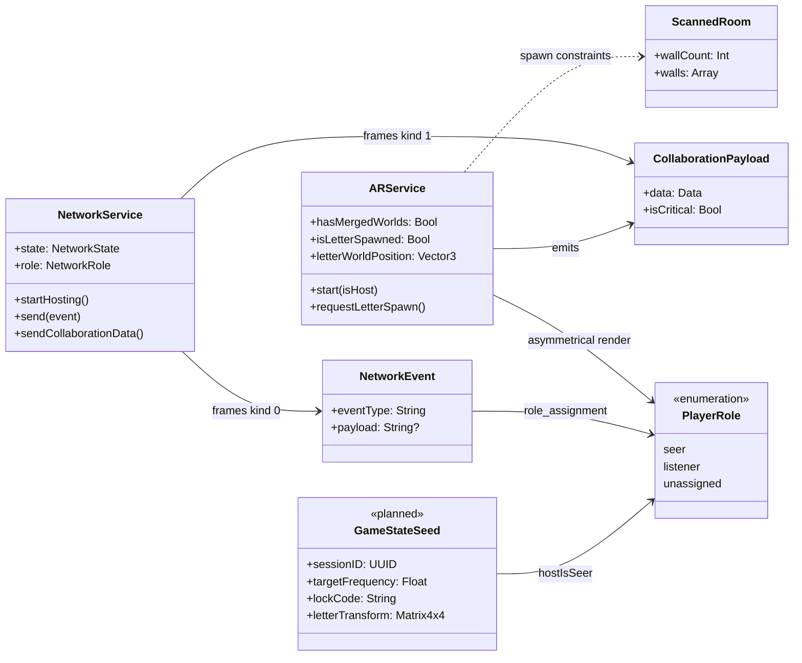

| Entity | Owner | Transport | Purpose |
| :--- | :--- | :--- | :--- |
| `NetworkEvent` | `NetworkService` | TCP JSON | Lightweight RPCs between devices |
| `CollaborationPayload` | `ARService` | TCP binary | ARKit world-merge data |
| `PlayerRole` | `GameplayInteractor` | Via `NetworkEvent` | Seer / Listener sensory gating |
| `LetterSpawnPayload` | Host | Via `letter_spawn` event | Deterministic letter placement |
| `GameStateSeed` | Host (planned) | Single sync event | All puzzle variables for a session |
| `ScannedRoom` | `RoomScanService` | Local only | Pre-AR geometry from RoomPlan |

### Every Whisper Has a Name

| Event | Direction | When fired |
| :--- | :--- | :--- |
| `begin_seance` | Host → Guest | Room scan complete |
| `doll_touched` | Either → Other | Doll tapped — curse begins |
| `role_assignment` | Host → Guest | Random Seer/Listener split |
| `letter_spawn` | Host → Guest | Letter anchor placed |
| `mission_revealed` | Either → Other | Seer confirms letter discovery; both advance |
| `seal1_spawn` | Host → Guest | Lock mechanism + footprint trail placed |
| `frequency_matched` | Either → Other | Listener locks scanner to target frequency |
| `ping` / `pong` | Either | Latency diagnostics |

---

## 6. The Vault — Project Structure

Everything above lives somewhere specific in the repo. No AR call happens in a View, no UI string lives in the Interactor — the folder structure enforces the same boundaries as the architecture itself.

```
Split Mechanics/
├── README.md
├── Split Mechanics.xcodeproj/
└── Split Mechanics/
    ├── Info.plist
    ├── Assets.xcassets/
    └── CursedRoom/
        ├── App/                    AppCoordinator, entry point
        ├── Core/
        │   ├── AR/                 ARService, RealityKit entities
        │   ├── Network/            NetworkService, NetworkModels
        │   ├── Audio/              GameAudioSession, LetterProximityHaptics, LetterAudioEngine (unused)
        │   ├── Math/               RandomnessMath, SpatialMath
        │   └── Room/               RoomScanService, ScannedRoom
        ├── Modules/                VIPER feature modules
        │   ├── Lobby/
        │   ├── Scanning/           Host LiDAR scan
        │   ├── Seance/             World merge + doll
        │   └── Gameplay/           Roles, letter hunt, Seer/Listener views
        ├── UIComponents/           Shared overlays and transitions
        └── Resources/
            ├── Sounds/             sounds.json manifest (letter_whisper → BGM.mp3), BGM.mp3
            └── Models/             Doll USDZ
```

| Folder | Responsibility |
| :--- | :--- |
| `App/` | Composition root, screen state machine, dependency injection |
| `Core/` | Framework-facing singletons and pure math — no UI |
| `Modules/` | One VIPER stack per game screen |
| `UIComponents/` | Reusable SwiftUI pieces (curse transition, role reveal) |
| `Resources/` | Bundled audio, 3D models, SpriteKit scenes |

---

## 7. Keeping the Curse Contained — Security & App Store

Nothing about the curse leaves the living room. Every byte stays device-to-device, over the same Wi-Fi network the players are already standing under.

### Required Privacy Keys

| Key | Purpose |
| :--- | :--- |
| `NSCameraUsageDescription` | ARKit passthrough and RoomPlan scanning |
| `NSLocalNetworkUsageDescription` | Bonjour peer discovery and TCP gameplay sync |
| `NSBonjourServices` → `_arcurse._tcp` | Advertise and browse the game service |
| `UIRequiredDeviceCapabilities` → `arkit` | App Store device filter |

### Compliance Notes

| Topic | Status |
| :--- | :--- |
| Local Network permission prompt | Required on first connect — implemented |
| Data leaves device? | **No** — all traffic is device-to-device on local Wi-Fi |
| Background modes | Not needed — foreground-only experience |
| Encryption export | Standard local TCP, no TLS — declare exempt at submission |
| LiDAR gating | RoomPlan runs on Host only; Guest needs ARKit only |

---

## 8. What Could Go Wrong in the Dark

Every haunted house has weak floorboards. Here's where this one might creak, and what's already in place to keep it from collapsing mid-scare.

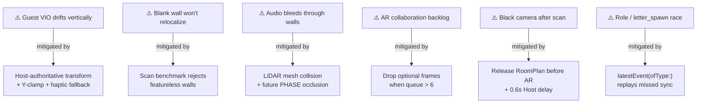

| Risk | Severity | Mitigation |
| :--- | :---: | :--- |
| Guest VIO Z-drift | High | Host-authoritative `letter_spawn` transform; Y clamped to floor + 1.4 m; haptic fallback |
| Blank wall relocalization | High | Scan benchmark rejects featureless walls; prompt to scan textured areas |
| Audio bleeding through walls | Medium | LiDAR mesh collision; future PHASE occlusion |
| Collaboration backlog | Medium | Drop optional AR frames when queue > 6 |
| Black camera after scan | Medium | Release RoomPlan before AR; 0.6 s Host startup delay |
| Role / `letter_spawn` race | Medium | `latestEvent(ofType:)` replays missed `role_assignment` and `letter_spawn` on Guest |
| State desync on puzzles | Medium | `GameStateSeed` host authority (planned) |
| Audio direction confusion | Medium | Camera-bound listener; haptic breadcrumbs |
| Peer disconnect | Low | `peerDisconnected` flag → return to lobby |
| Missing audio asset | Low | `ARService` async `AudioFileResource` load; logs `Letter audio not found in bundle` and skips playback |

---

## 9. The Toolbox

| Framework | Role in this project |
| :--- | :--- |
| **Swift 6 + SwiftUI** | Language and UI |
| **ARKit** | World tracking, collaboration, plane detection |
| **RealityKit** | 3D entities, `SpatialAudioComponent`, `AudioFileResource`, `entity.playAudio()` |
| **RoomPlan** | Host room scanning (LiDAR) |
| **Network.framework** | TCP + Bonjour (`NWListener`, `NWBrowser`, `NWConnection`) |
| **CoreHaptics** | Listener proximity feedback |
| **Combine** | Reactive wiring between VIPER and services |
| **AVFoundation** | `GameAudioSession` playback category; `LetterAudioEngine` (Doppler stub, not in live path) |
| **PHASE** | Planned — advanced spatial audio occlusion beyond RealityKit mesh collision |

---

<p align="center">
  <strong>The Cursed Room</strong><br/>
  <em>VIPER · ARKit Collaboration · Network.framework</em><br/>
  <em>Two phones. One curse. Trust the voice next to you.</em>
</p>
