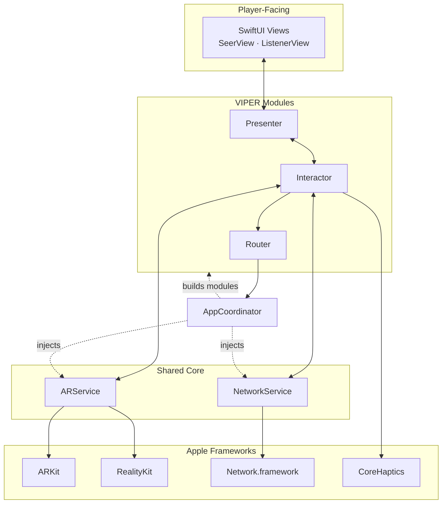
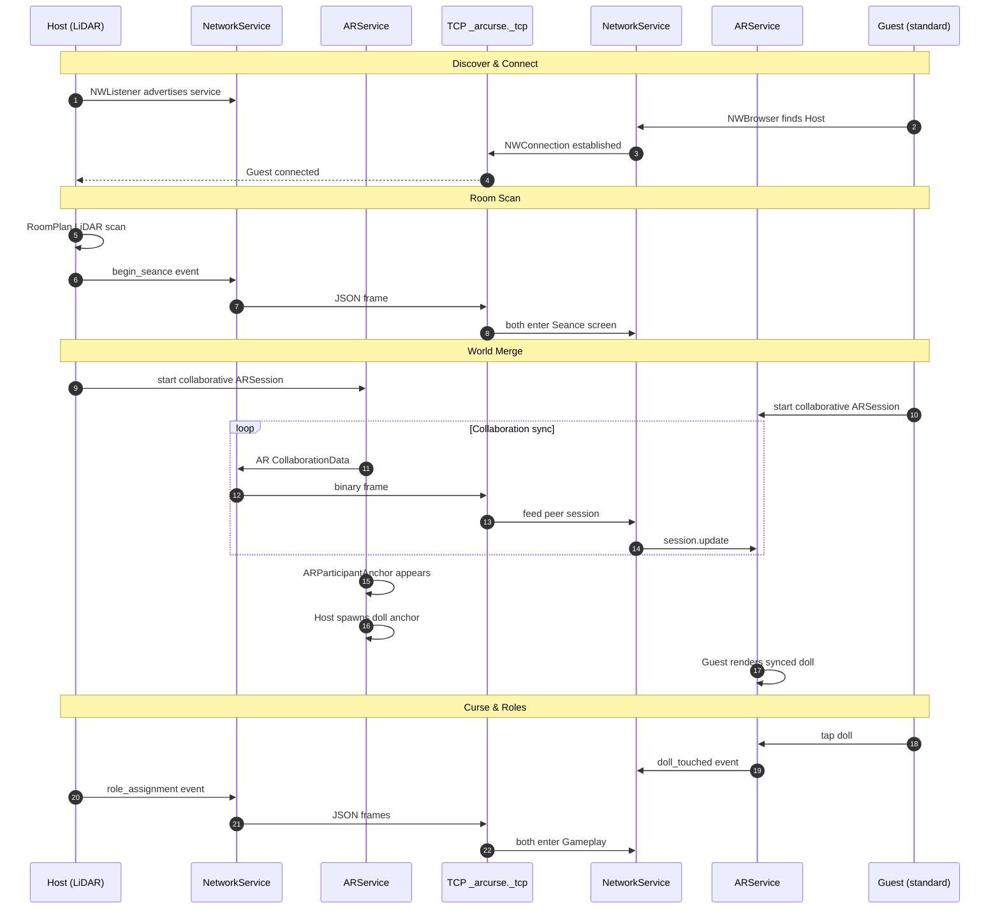
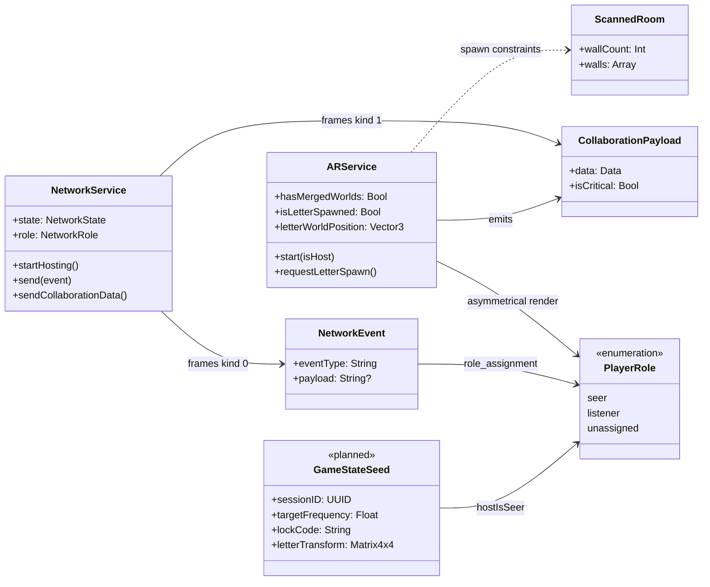

# The Cursed Room

### Technical Design Document

> **Version 1.1** · iOS 18+ · Swift 6 · VIPER + SwiftUI  
> Two iPhones. One curse. Split senses. Shared room.

---

## Table of Contents

1. [Vision & Player Experience](#1-vision--player-experience)
2. [System Architecture](#2-system-architecture)
3. [Device Connection & World Sync](#3-device-connection--world-sync)
4. [Core Engineering](#4-core-engineering)
5. [Data Model](#5-data-model)
6. [Project Structure](#6-project-structure)
7. [Security & App Store](#7-security--app-store)
8. [Risks & Mitigations](#8-risks--mitigations)

---

## 1. Vision & Player Experience

**The Cursed Room** is an asymmetrical, local-multiplayer AR horror game. Two players in the same physical room cooperate over Wi-Fi — but they no longer share the same senses. One sees what the other cannot. One hears what the other cannot. They must communicate out loud to survive.

After a cursed doll is touched, senses split at random. The **Seer** perceives hidden supernatural objects in AR but hears only static. The **Listener** navigates by spatial sound and haptic pulses, their screen blurred and darkened. Together they hunt seal fragments, solve puzzles, and escape before the monster awakens.

### Hardware Roles

The game deliberately exploits a hardware split rather than requiring identical devices.

| | Host | Guest |
| :--- | :--- | :--- |
| **Device** | LiDAR-equipped iPhone | Any standard ARKit iPhone |
| **Tracking** | LiDAR + visual-inertial odometry | Visual-inertial odometry only |
| **Responsibilities** | Room scan, world authority, spawn decisions | World merge, sensory gameplay |
| **Exclusive capabilities** | RoomPlan scan, scene mesh reconstruction | — |

> The Host builds a metrically accurate room model. The Guest merges into that coordinate space through ARKit collaborative sessions, exchanging map data over a local TCP connection.

### Gameplay Journey

| Beat | Summary |
| :--- | :--- |
| **The Setup** | Story intro → Host scans the room → both enter shared AR → touch the doll → curse activates, senses split |
| **Seal #1 — Asymmetrical Investigation** | Roles revealed → Listener hears spatial cues, Seer sees hidden clues → first letter found → main mission revealed |
| **Seal #2 — Split Investigation** | Listener deciphers whispers for a code → Seer follows AR footprints to a locked mechanism → first seal piece collected |
| **Seal #3 — Frequency Puzzle** | Seer finds a hidden frequency → Listener tunes a scanner to match → second seal piece revealed |
| **Ritual & Escape** | Haptics guide both to the ritual site → Seer restores the seal → curse broken → countdown escape to a safe zone |

### Beat-by-Beat Design

#### The Setup

Both players connect over local Wi-Fi. The Host scans the real room with LiDAR; the Guest waits, then both enter a shared AR space. A doll appears at the center of the floor. When both touch it, the curse activates — senses split at random into Seer and Listener.

#### Seal #1 — Asymmetrical Investigation

After roles are assigned, the first hidden objective appears: **The Letter**, anchored to a wall at eye level. The Listener is guided by spatial audio and haptic pulses toward it; the Seer follows and reveals it visually on arrival.

When the Seer comes within 1.0 m of the letter, a mission overlay appears:

> *"To break the curse, you must find the two pieces of the ancient seal. Only when the seal is restored will the monster lose its power."*

Tapping **Next** syncs both players forward into the next beat.

| Role | Letter experience |
| :--- | :--- |
| **Seer** | White AR plane on wall; audio muted |
| **Listener** | Invisible entity; spatial audio + distance haptics |

#### Seal #2 — Split Investigation

The Seer alone sees a trail of bloody footprints leading from the room center to a 3D lock mechanism on a wall. The Listener's screen stays blinded. Meanwhile, the Listener hears distant whispers — moving closer makes words clearer, revealing a code the Seer needs to unlock the mechanism and collect the first seal piece.

#### Seal #3 — Frequency Puzzle

The Seer discovers a hidden number in AR that corresponds to an acoustic frequency. The Listener opens a **Frequency Scanner** — a SwiftUI dial that crossfades from white noise to a clear clue track as they approach the target. Signal clarity scales with accuracy:

$$C = \max\left(0,\ 1 - \frac{|F_p - F_t|}{\text{HearingRange}}\right)$$

When the Listener locks the frequency, the Seer hears a mechanism activate and collects the second seal piece.

#### Ritual & Escape

Haptic feedback intensifies as both players return to the ritual site. The Seer places both seal pieces on a pedestal; senses restore. A countdown begins — a safe zone appears on the floor and both must reach it together before the monster catches them.

### Sensory Split at a Glance

| Sense | Seer | Listener |
| :--- | :--- | :--- |
| **Vision** | Full AR passthrough + hidden entities | Heavy blur, dark vignette, no clue visuals |
| **Audio** | Static / white noise overlay | Spatial 3D audio anchored to world positions |
| **Haptics** | None | Distance-modulated pulse toward objectives |
| **Guidance role** | Leads physically, reveals clues on arrival | Leads navigation by sound and vibration |

---

## 2. System Architecture

The app is structured as **VIPER modules** wired together by a single `AppCoordinator`. Complex AR and network state never leak into SwiftUI views — they live in two long-lived service singletons injected at the composition root.

### Architectural Story

```
Player taps UI  →  Presenter formats state  →  View renders
                        ↕
                   Interactor decides
                        ↕
              ARService / NetworkService
                        ↕
              ARKit · RealityKit · Network.framework
```

| Layer | Job | Never does |
| :--- | :--- | :--- |
| **View** | Render UI, overlays, gestures | Talk to ARKit or TCP directly |
| **Presenter** | Expose `@Published` view state | Contain business rules |
| **Interactor** | Distance checks, role logic, timers, service wiring | Render SwiftUI |
| **Entity** | Pure data (`NetworkEvent`, `PlayerRole`) | Side effects |
| **Router** | Trigger screen transitions | Hold game state |

### Persistent Services

| Service | Owns | Lives from |
| :--- | :--- | :--- |
| `NetworkService` | Bonjour discovery, TCP connection, event bus | App launch |
| `ARService` | Collaborative `ARView`, entity spawning, spatial audio | Seance screen onward |

`AppCoordinator` drives navigation: `lobby → scanning → seance → curseBegins → gameplay`.

### Design Principles

| Principle | What it means |
| :--- | :--- |
| **Host authority** | Random seeds, spawn coordinates, and puzzle answers are computed once on the Host and replicated to the Guest |
| **Sensory separation** | Audio and visuals are gated per-entity by `PlayerRole` — not just UI filters |
| **Single TCP pipe** | JSON gameplay events and binary AR blobs share one connection, distinguished by a 1-byte frame header |
| **No MultipeerConnectivity** | All transport uses `Network.framework` with Bonjour service `_arcurse._tcp` |

### Layer Ownership

Every feature in the game respects strict VIPER boundaries.

| Concern | Owner | Never in |
| :--- | :--- | :--- |
| Proximity / distance checks | `GameplayInteractor` | View, Presenter, `ARService` |
| 60 fps proximity loops | `GameplayInteractor` | View |
| Network event parse & dispatch | `GameplayInteractor` | View |
| Entity spawn & role-gated visibility | `ARService` | Interactor, View |
| Overlay text, buttons, sliders | `GameplayView` | Interactor |
| `@Published` view state | `GameplayPresenter` | Interactor |

### Architecture Diagram



---

## 3. Device Connection & World Sync

Connection follows a strict handshake: discover the Host over Bonjour, open TCP, scan the room, then merge AR worlds before any gameplay entities appear.

### Connection Sequence



### Wire Protocol

Every TCP message uses a fixed header so the receiver can route JSON events separately from AR binary blobs.

| Byte(s) | Field | Values |
| :--- | :--- | :--- |
| 1 | **Kind** | `0` = JSON gameplay event · `1` = AR collaboration blob |
| 4 | **Length** | Big-endian `UInt32` payload size |
| N | **Payload** | `NetworkEvent` JSON or `NSKeyedArchiver` ARKit data |

| Kind | Contents | Backpressure rule |
| :--- | :--- | :--- |
| `0` | `role_assignment`, `letter_spawn`, `doll_touched`, etc. | Always delivered |
| `1` | `ARSession.CollaborationData` | Non-critical frames dropped when send queue exceeds 6 |

### Screen Progression

| Screen | Trigger | Both devices? |
| :--- | :--- | :--- |
| `Lobby` | App launch | Yes |
| `Scanning` | TCP connected | Host scans; Guest waits |
| `Seance` | `begin_seance` received | Yes — collaborative AR |
| `CurseBegins` | `doll_touched` received | Yes — transition overlay |
| `Gameplay` | Curse animation complete | Yes — role-specific UI |

---

## 4. Core Engineering

### 4.1 World Merging

**Problem:** Two different tracking systems must render the same entity at the same real-world position.

**Solution pipeline:**

| Step | Actor | Action |
| :--- | :--- | :--- |
| 1 | Host | RoomPlan captures walls, floors, objects → `ScannedRoom` |
| 2 | Both | Start `ARWorldTrackingConfiguration` with `isCollaborationEnabled` |
| 3 | Both | Exchange `CollaborationData` over TCP (kind = 1) |
| 4 | Both | `ARParticipantAnchor` detected → `hasMergedWorlds = true` |
| 5 | Host | Adds shared `ARAnchor` for doll / letter |
| 6 | Guest | Receives anchor via collaboration; renders local RealityKit content |
| 7 | Host | Sends `letter_spawn` transform as network fallback |

The Host also enables LiDAR scene mesh with collision and occlusion so spatial audio can respect wall geometry.

### 4.2 Predetermination Math

All randomness is **Host-computed and Guest-replicated** to prevent desync.

#### Marble Bag — Frequency Puzzle

Distinct acoustic frequencies are drawn from a finite pool without replacement, ensuring variety across play sessions.

| Concept | Behavior |
| :--- | :--- |
| Pool | Predefined Hz values (e.g. 220, 277, 330 … 698) |
| Draw | Random index into remaining values; remove on use |
| Sync | Target frequency travels inside `GameStateSeed` (planned) |

**Listener forgiveness** when tuning the scanner:

$$C = \max\left(0,\ 1 - \frac{|F_p - F_t|}{\text{HearingRange}}\right)$$

#### Bounded Randomness — 3D Spawning

| Technique | Used for | Rule |
| :--- | :--- | :--- |
| **Gaussian wall weighting** | Letter placement | Walls ~1.5 m from camera score highest; larger walls get area bonus |
| **Gaussian clamping** | Lateral wall offset | Sample clamped to ±35% of wall width |
| **Rejection sampling** | Doll floor placement | Up to 40 attempts; reject points within 0.4 m of obstacles |
| **Y-axis clamping** | All wall clues | Fixed at 1.4 m above lowest tracked floor |

### 4.3 Sensory Engine

Asymmetry is enforced at the **entity level**, not just the UI layer.

#### Spatial Audio (RealityKit)

| Parameter | Seer | Listener |
| :--- | :--- | :--- |
| Letter visibility | White `ModelEntity` plane | Invisible — audio emitter only |
| `SpatialAudioComponent` gain | −60 dB (muted) | +20 dB (room-wide) |
| Distance attenuation | `.rolloff(factor: 15.0)` | `.rolloff(factor: 15.0)` |
| Tap interaction | Enabled | Disabled |

The Listener hunts by ear. The Seer hunts by sight. Neither can solo the objective.

#### Haptic Proximity (CoreHaptics)

The Listener receives a continuous haptic pulse whose intensity scales with distance to the hidden letter, updated at 60 fps.

| Distance | Intensity |
| :--- | :--- |
| ≤ 0.2 m | 1.0 (maximum) |
| ≥ 3.0 m | 0.0 (silent) |
| Between | Linear falloff |

Sharpness co-scales with intensity so distant rumble feels soft and proximity feels sharp.

#### Visual Impairment (Listener UI)

| Effect | Implementation |
| :--- | :--- |
| Blur | `.blur(radius: 20)` over AR passthrough |
| Vignette | `RadialGradient` — opaque edges, faint center |
| Static | `StaticNoiseOverlay` (planned) |

---

## 5. Data Model

Core entities group into three domains: **network transport**, **AR state**, and **gameplay identity**.

### Entity Class Diagram



### Entity Reference

| Entity | Owner | Transport | Purpose |
| :--- | :--- | :--- | :--- |
| `NetworkEvent` | `NetworkService` | TCP JSON | Lightweight RPCs between devices |
| `CollaborationPayload` | `ARService` | TCP binary | ARKit world-merge data |
| `PlayerRole` | `GameplayInteractor` | Via `NetworkEvent` | Seer / Listener sensory gating |
| `LetterSpawnPayload` | Host | Via `letter_spawn` event | Deterministic letter placement |
| `GameStateSeed` | Host (planned) | Single sync event | All puzzle variables for a session |
| `ScannedRoom` | `RoomScanService` | Local only | Pre-AR geometry from RoomPlan |

### Network Events

| Event | Direction | When fired |
| :--- | :--- | :--- |
| `begin_seance` | Host → Guest | Room scan complete |
| `doll_touched` | Either → Other | Doll tapped — curse begins |
| `role_assignment` | Host → Guest | Random Seer/Listener split |
| `letter_spawn` | Host → Guest | Letter anchor placed |
| `mission_revealed` | Either → Other | Seer confirms letter discovery; both advance |
| `seal1_spawn` | Host → Guest | Lock mechanism + footprint trail placed |
| `frequency_matched` | Either → Other | Listener locks scanner to target frequency |
| `ping` / `pong` | Either | Latency diagnostics |

---

## 6. Project Structure

```
Split Mechanics/
├── README.md
├── Split Mechanics.xcodeproj/
└── Split Mechanics/
    ├── Info.plist
    ├── Assets.xcassets/
    └── CursedRoom/
        ├── App/                    AppCoordinator, entry point
        ├── Core/
        │   ├── AR/                 ARService, RealityKit entities
        │   ├── Network/            NetworkService, NetworkModels
        │   ├── Audio/              GameAudioSession, haptics, PHASE (planned)
        │   ├── Math/               RandomnessMath, SpatialMath
        │   └── Room/               RoomScanService, ScannedRoom
        ├── Modules/                VIPER feature modules
        │   ├── Lobby/
        │   ├── Scanning/           Host LiDAR scan
        │   ├── Seance/             World merge + doll
        │   └── Gameplay/           Roles, letter hunt, Seer/Listener views
        ├── UIComponents/           Shared overlays and transitions
        └── Resources/
            ├── Sounds/             sounds.json manifest, BGM.mp3
            └── Models/             Doll USDZ
```

| Folder | Responsibility |
| :--- | :--- |
| `App/` | Composition root, screen state machine, dependency injection |
| `Core/` | Framework-facing singletons and pure math — no UI |
| `Modules/` | One VIPER stack per game screen |
| `UIComponents/` | Reusable SwiftUI pieces (curse transition, role reveal) |
| `Resources/` | Bundled audio, 3D models, SpriteKit scenes |

---

## 7. Security & App Store

### Required Privacy Keys

| Key | Purpose |
| :--- | :--- |
| `NSCameraUsageDescription` | ARKit passthrough and RoomPlan scanning |
| `NSLocalNetworkUsageDescription` | Bonjour peer discovery and TCP gameplay sync |
| `NSBonjourServices` → `_arcurse._tcp` | Advertise and browse the game service |
| `UIRequiredDeviceCapabilities` → `arkit` | App Store device filter |

### Compliance Notes

| Topic | Status |
| :--- | :--- |
| Local Network permission prompt | Required on first connect — implemented |
| Data leaves device? | **No** — all traffic is device-to-device on local Wi-Fi |
| Background modes | Not needed — foreground-only experience |
| Encryption export | Standard local TCP, no TLS — declare exempt at submission |
| LiDAR gating | RoomPlan runs on Host only; Guest needs ARKit only |

---

## 8. Risks & Mitigations

| Risk | Severity | Mitigation |
| :--- | :---: | :--- |
| Guest VIO Z-drift | High | Host-authoritative `letter_spawn` transform; Y clamped to floor + 1.4 m; haptic fallback |
| Blank wall relocalization | High | Scan benchmark rejects featureless walls; prompt to scan textured areas |
| Audio bleeding through walls | Medium | LiDAR mesh collision; future PHASE occlusion |
| Collaboration backlog | Medium | Drop optional AR frames when queue > 6 |
| Black camera after scan | Medium | Release RoomPlan before AR; 0.6 s Host startup delay |
| Role assignment race | Medium | `latestEvent(ofType:)` replays missed sync on Guest |
| State desync on puzzles | Medium | `GameStateSeed` host authority (planned) |
| Audio direction confusion | Medium | Camera-bound listener; haptic breadcrumbs |
| Peer disconnect | Low | `peerDisconnected` flag → return to lobby |
| Missing audio asset | Low | Async load with graceful fallback logging |

---

## Technology Stack

| Framework | Role in this project |
| :--- | :--- |
| **Swift 6 + SwiftUI** | Language and UI |
| **ARKit** | World tracking, collaboration, plane detection |
| **RealityKit** | 3D entities, `SpatialAudioComponent` |
| **RoomPlan** | Host room scanning (LiDAR) |
| **Network.framework** | TCP + Bonjour (`NWListener`, `NWBrowser`, `NWConnection`) |
| **CoreHaptics** | Listener proximity feedback |
| **Combine** | Reactive wiring between VIPER and services |
| **PHASE** | Planned — advanced spatial audio occlusion |

---

<p align="center">
  <strong>The Cursed Room</strong><br/>
  <em>VIPER · ARKit Collaboration · Network.framework</em>
</p>
